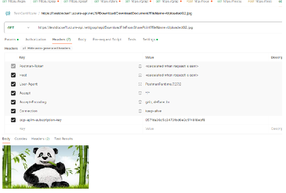

# Azure APIs for SharePoint Access with Microsoft Graph, and Azure DevOps deployments with Bicep scripts

## Project's description

This article details implementing Azure APIM functions which transfer data to and from a SharePoint site.

The article provides a solutions to provides selected access to the SharePoint site and allows for certificate and oAuth2 authentication.

## Online article
Details about this project can be read in my blog's articles here: 

[Article1](https://www.ideliversoft.com/post/video-tutorial-azure-apis-for-sharepoint-access-with-microsoft-graph-azure-devops-deployments-wit)

[Article2](https://www.ideliversoft.com/post/video-tutorial-azure-apis-for-sharepoint-access-with-microsoft-graph-azure-devops-deployments-wit-1)

## Context
I have done this work in 2024. The main technologies used were: **.NET Core**, **Graph API**, **Bicep scripts**, and a variety of **Azure resources**.

